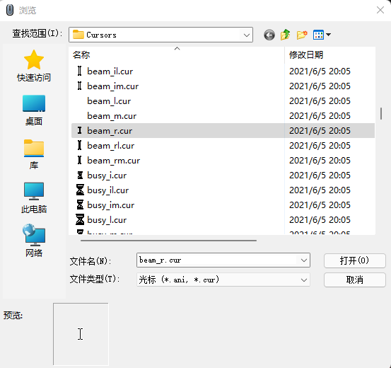
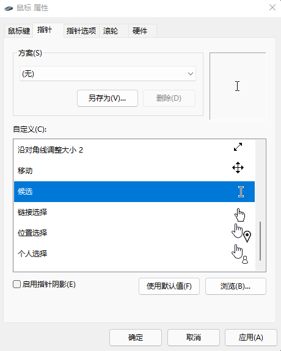
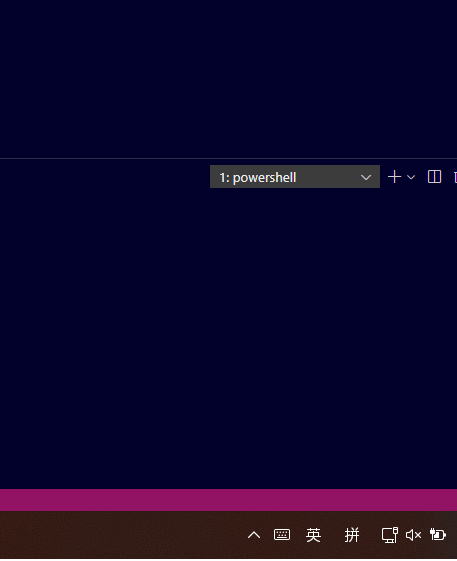

# DynCursor
## Windows系统动态修改鼠标指针光标图标样式, 根据键盘布局/语言/输入法的切换而变化.

假如在Windows上安装了多门语言, 使用时可能很难感知当前是什么语言什么输入法, 需要频繁查看任务栏语言图标或者直接打字来判断, 加上微软拼音输入法会"智能"切换中/英, 十分影响心态;

此工具能帮助快速判断所用的输入法, 通过简单几步配置, 即可在使用英文时看到鼠标白色指针, 使用中文时看到鼠标黑色指针(也可以[下载](http://www.rw-designer.com/cursor-library/set-0)或自制其他颜色和图标的指针);

实现思路是一直查询当前使用的语言输入法, 如果当前语言是`中文(简体,中国)`且输入法的[Conversion Mode](https://docs.microsoft.com/en-us/windows/win32/intl/ime-conversion-mode-values)非0, 则替换鼠标指针的状态
1. `正常选择`<image src="resources/figure/aero_arrow.cur" height="20" width="20"></image>替换为`帮助选择`<image src="resources/figure/aero_helpsel.cur" height="20" width="20"></image>
1. `文本选择`<image src="resources/figure/beam_r.cur" height="20" width="20"></image>替换为`候选`<image src="resources/figure/up_r.cur" height="20" width="20"></image>
1. `链接选择`<image src="resources/figure/aero_link.cur" height="20" width="20"></image>替换为`不可用`<image src="resources/figure/aero_unavail.cur" height="20" width="20"></image>

鼠标指针状态替换后, 原本显示`正常选择`<image src="resources/figure/aero_arrow.cur" height="20" width="20"></image>的地方会显示`帮助选择`<image src="resources/figure/aero_helpsel.cur" height="20" width="20"></image>, 原本显示`帮助选择`<image src="resources/figure/aero_helpsel.cur" height="20" width="20"></image>的地方会显示`正常选择`<image src="resources/figure/aero_arrow.cur" height="20" width="20"></image>, 因此只需要把`帮助选择`<image src="resources/figure/aero_helpsel.cur" height="20" width="20"></image>的图标修改成其他颜色指针<image src="resources/figure/arrow_r.cur" height="20" width="20"></image>, 即可优雅实现动态光标颜色; 其他鼠标指针状态同理;
默认取代`帮助选择`<image src="resources/figure/aero_helpsel.cur" height="20" width="20"></image>,`候选`<image src="resources/figure/up_r.cur" height="20" width="20"></image>,`不可用`<image src="resources/figure/aero_unavail.cur" height="20" width="20"></image>是因为这些指针状态极少出现, 或者可以在[配置文件](config/config.yaml)中修改成其他替换指针;

## 使用
1. 下载[DynCursor.zip](https://github.com/alvinfunborn/DynCursor/releases), 解压到任意目录, 无需安装
1. 按需修改配置文件[config/config.yaml](config/config.yaml)
    > 默认配置是在输入法为`中文(简体,中国)`时修改`标准箭头`<image src="resources/figure/aero_arrow.cur" height="20" width="20"></image>和`文本选择`<image src="resources/figure/beam_r.cur" height="20" width="20"></image>和`链接选择`<image src="resources/figure/aero_link.cur" height="20" width="20"></image>的样式; 其他光标保持不变;
1. 建议修改`鼠标属性-指针`自定义里的图标, 会有更好的观感, 在resources/cur目录里有已下载的一些图标, 也可以在[rw designer](http://www.rw-designer.com/cursor-library/set-0)挑选合适的图标
    1. 修改`帮助选择`样式
        
        
        
    1. 修改`候选`样式
        
        
        
    1. 修改`不可用`样式
        
        
        
1. 建议关闭`鼠标属性-指针选项-在打字时隐藏指针`, 打开`当按CTRL键时显示指针的位置`
1. 启动DynCursor.exe, 这是一个无窗体程序, 启动后切换输入法来查看效果
1. 如果要停止运行, 打开任务管理器找到`DynCursor.exe`, 结束任务
1. 如果要重置鼠标指针, 在`鼠标属性-指针`中选择任一方案应用

## 效果图
- 使用个性化图标

## 如何设置开机自启动
[在 Windows 中更改哪些应用在启动时自动运行](https://support.microsoft.com/zh-cn/windows/%E5%9C%A8-windows-%E4%B8%AD%E6%9B%B4%E6%94%B9%E5%93%AA%E4%BA%9B%E5%BA%94%E7%94%A8%E5%9C%A8%E5%90%AF%E5%8A%A8%E6%97%B6%E8%87%AA%E5%8A%A8%E8%BF%90%E8%A1%8C-9115d841-735e-488d-e749-9ba301d441e6#ID0EBD=Windows_10)

## 附录
### 常用语言编码
语言|编码
-|-
中文(简体,中国)|0804
中文(繁体,中国台湾)|0404
中文(繁体,中国香港)|0C04
中文(繁体,中国澳门)|1404
英语(美国)|0409
英语(英国)|0809

更多编码参考[Windows Language Code Identifier (LCID) Reference](https://docs.microsoft.com/en-us/openspecs/windows_protocols/ms-lcid/70feba9f-294e-491e-b6eb-56532684c37f)

### 指针状态编码
状态|样式|编码
-|-|-
正常选择|标准箭头|32512
帮助选择|标准箭头+问号|32651
后台运行|标准箭头+小沙漏|32650
忙|沙漏|32514
精确选择|十字|32515
文本选择|I|32513
不可用|斜线圆圈|32648
垂直调整大小|南北向双向箭头|32654
水平调整大小|东西向双向箭头|32644
沿对角线调整大小1|西北-东南的双向箭头|32642
沿对角线调整大小2|东北-西南的双向箭头|32643
移动|四向箭头|32646
候选|向上的箭头|32516
链接选择|手指|32649

更多编码参考[The name of the cursor resource](https://docs.microsoft.com/en-us/windows/win32/api/winuser/nf-winuser-loadcursorw)